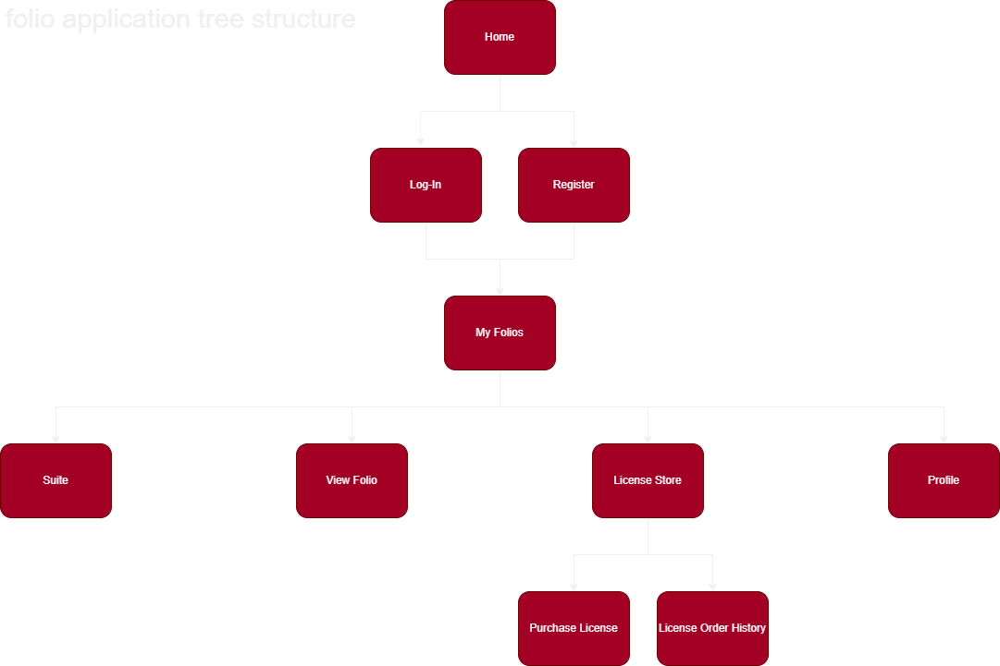
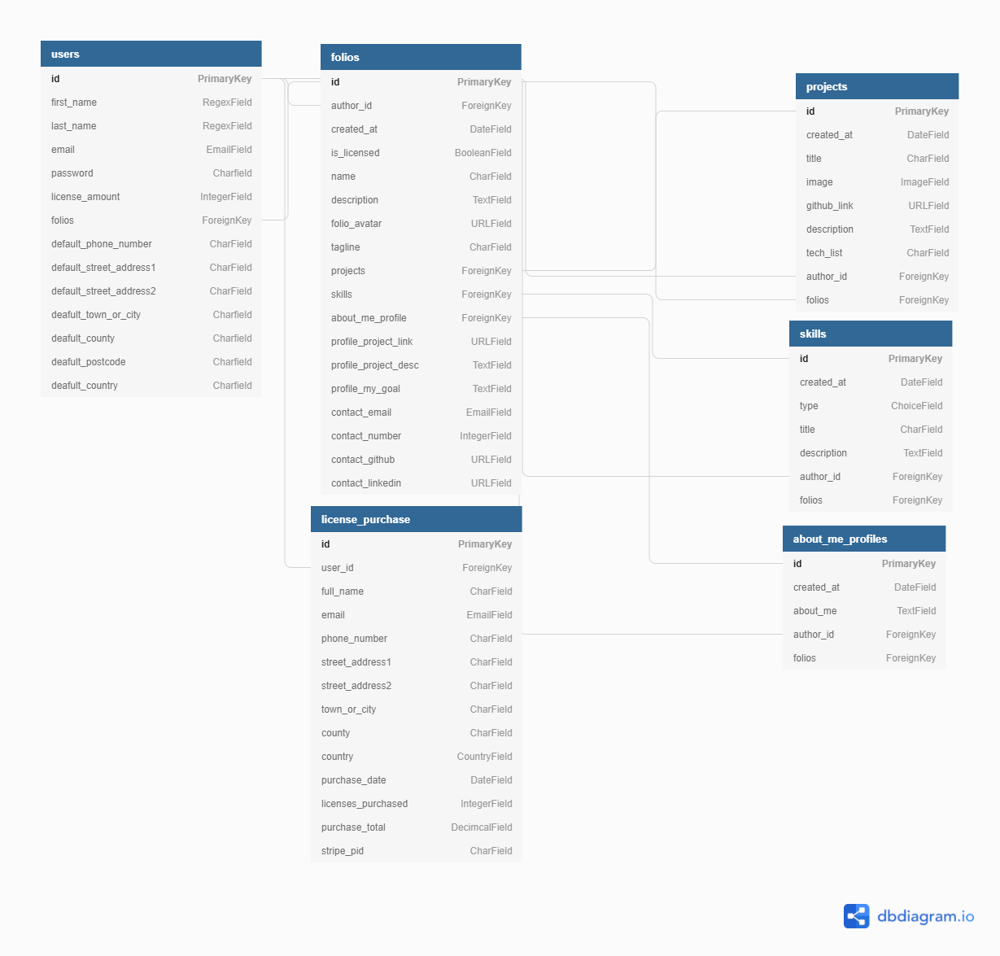
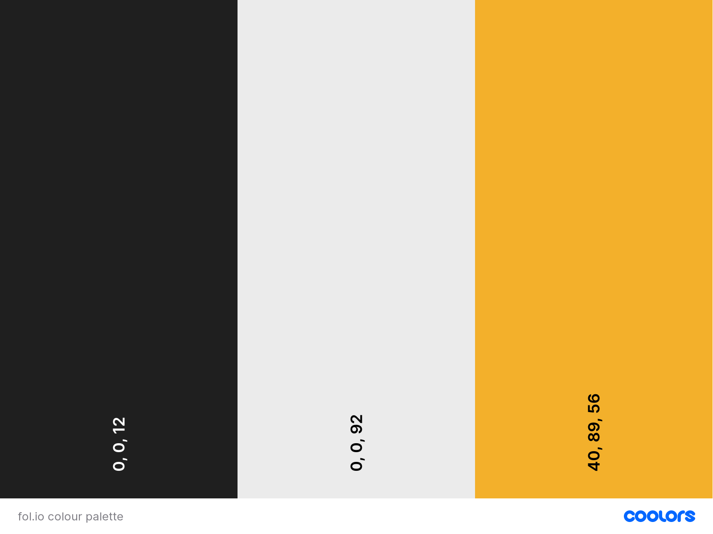
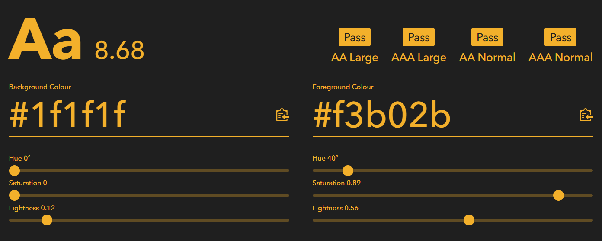
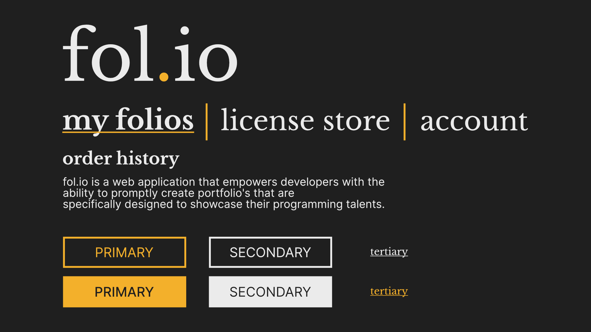

#  fol.io

*image of index page on multiple devices*

*brief description of application*

*link to deployed application*

## Table of Contents

*table of contents generated from https://ecotrust-canada.github.io/markdown-toc/*

## UX

### Strategy

#### The Problem

It's well documented within the IT industry that it's becoming increasingly difficult for businesses to fill their IT positions with qualified personnel.

#### The Solutions

[This article](https://www.codingame.com/work/blog/find-developers/top-it-recruitment-challenges/) by Nathalie Figuière, which dissects these challenges utilizing survey data given from developers & current IT HR personnel, proposes a variety of solutions to help combat this. The first three solutions Figuière provides, are the ones that are relevant to this application, those being the:

- Removal of IT degree requirements
- Consideration of non-traditionally educated developers
- Broadening of searching for candidates

Despite degree's remaining a key requirement within most company recruitment processes, the removal of degree requirements is [becoming an increasingly more common stance](https://www.cnbc.com/2018/08/16/15-companies-that-no-longer-require-employees-to-have-a-college-degree.html). However, as [this article](https://www.businessinsider.com/apple-google-hire-jobs-without-degree-experts-say-college-important-2020-10?r=US&IR=T) suggests, experts still say that a college degree remains the best bet in landing a well paid tech job.

The consideration of non-traditionally educated developers regards those who are self-taught, that learned their development skills from other forms of educational resources such as videos within YouTube or online courses hosted by Udemy etc. Figuière dives deeper within [this article](https://www.codingame.com/work/blog/tech-recruiting/why-you-should-hire-self-taught-developers/), presenting reasons why self-taught developers should be considered, some notable reasons being that self-taught developers are:

- Eagerly motivated given their education is driven by themselves.
- Likely more communicative as they're often integrating within online tech communities.
- Adaptable in taking on new tech, not relying on tech skills acquired in school.
- Natural problem solvers given they've likely learned from hitting roadblocks & chicanes during their learning.

The broadening of searching for candidates, suggests that businesses should employ multichannel recruitment strategies, utilizing online platforms such as LinkedIn, Indeed or community events such as hackathons or coding contests.

A conflicting aspect to an application like this, is that developers are obviously able to create their own portfolio to highlight their work. One negative to this however, is that it takes a lot of time to create a portfolio and aspiring developers who are self-taught are likely to be working full-time, meaning they have limited time available. A platform that presents their talents & work whilst being quick & easy to update would be beneficial, as they can focus their efforts on producing side-applications that are of more interest to potential employers.

It's also common place to tailor a CV for a particular job, so that what the employer sees is relevant to the job specification. It's likely a self-taught developer will be applying to numerous vacancies and adjustments will need to be made in order to present themselves in their best light to the employer. [This post](https://jobhelp.campaign.gov.uk/right-for-the-role-5-ways-to-tailor-your-cv-to-the-job-description/) suggests the following are resume elements that should be changed per application to target particular vacancies:

- The introduction
- Keywords
- Employment history

#### The Objectives

Taking these points into consideration, the application should aim to:

- Highlight the strengths & skills of self-taught developers.
    - The content developers create regarding themselves should be front & centre, acting as the focal point and the application itself should take a backseat when the content is being viewed from employers.
- Position itself stylistically alongside other alternative hiring sources.
    - The application should sport a UI that's familiar to these existing platforms, utilizing the conventions these platforms have created to make the application's UI easily learnable.
- Be a speedy & easy way for aspiring developers to update what they've previously done, what they're currently up to and their future goals.
    - The speedy nature requires as few clicks/actions as possible for the individual to achieve their respective goal with the application.
- Make the user's portfolio alterations simple and quick, saving them time and enabling them to apply for more vacancies.

#### The Audience

The target audience for this application are self-taught developers, who are likely participating in a career change whilst working full-time and would benefit from a quick and easy way to present their work and skills to potential employers.

Following B2C considerations, it's important that the application sports a simple, clean & modern brand look and targets their struggle with time management, being presented as a fast & effective solution to present their talents. The target audience is also likely in not justifying their purchasing decisions resulting in impulse buying, so the purchasing mechanism needs to be quick and easy.

#### User Stories

As a self-taught and aspiring developer, I want to be able to:

**Account Management**

- Register an account.
- Log in to the account I've registered.
- Change my account details.
- Reset my password.
- See the amount of portfolio licences I have and when they were purchased.

**Portfolio Management**

- Create a new portfolio.
- Edit an existing portfolio.
- Delete a portfolio.
- Duplicate a portfolio.

**Billing**

- Insert my billing details and have them be saved to my account.
- Select & change the amount of portfolio licences I'd like to purchase.
- Receive a confirmation e-mail confirming the purchase of portfolio licences.

As an employer interested in the developer, I want to be able to:

**Portfolio Viewing**

- View their portfolio.
- See what they're currently up to.
- Investigate what they've already created.
- Discern what their future aspirations are.
- Focus solely on the content that I'm interested in.
- Promptly know how I can contact them.

#### Potential Features

Below is a table of opportunities/problems that could potentially be included within the MVP of the application:

| Opportunities/Problem       | Importance | Feasibility |
|-----------------------------|------------|-------------|
| Account Management          | 5          | 5           |
| Purchase Portfolio Licences | 5          | 4           |
| Responsive Design           | 4          | 5           |
| Keyword Checklist           | 2          | 3           |
| Portfolio Viewer            | 5          | 5           |
| Themes                      | 2          | 3           |
| Creation Suite              | 5          | 4           |

### Scope

#### Current Features

The following is the list of features that will be included within the MVP of the application with reasons as to why:

- Account Management
    - Important data relating to the user such as their portfolios, account details and billing information will need to be tied to their account, making this an integral feature within the application.

- Purchase of Portfolio Licenses
    - The purchase of portfolio licences is what will achieve the application's business goals. Without it, in a realistic setting the application is not financially viable, therefore it's important to be present within the MVP of the application.

- Responsive Design
    - The application should be available to all possible users, no matter what device they have available to them. Although users are more likely to use desktop devices when using the application, focusing on this group would lessen the financial gains the application could potentially receive. For this reason and because it's expected by most users in this day and age, this feature should be present within the MVP of the application.

- Portfolio Viewer
    - For the application to be useful to the target audience, their potential employers need to be able to view their portfolio's (provided they have a licence). Without this, it would render the application as useless to the target audience, therefore it's integral that it should be present within the MVP of the application.

- Creation Suite
    - The user will need to add content to their portfolio's, therefore a creation suite of sorts where they're able to add text content, links, images etc. will be absolutely necessary. For this reason, it's important that this feature makes it into the MVP of the application.

#### Future Features

The following is a list of features that will be left for future release of the application with reason as to why:

- Keyword Checklist
   - The keyword checklist feature is where a customer can paste a job description into a text area and the feature will extract the keywords from the job description and add them to a checklist. The user is then able to view this checklist when creating their portfolio, making sure they address all the job criteria.
    - Although useful, this is essentially an additional time saving feature and is not integral to the application's core functionality. For this reason, this will be left for a later update of the application.

- Themes
    - The themes feature allows the user to further personalize their portfolio with a particular styling of their choice.
    - Although this would help the user differentiate themselves, it's not integral to the core functionality of the application. For this reason, it will be left for a future update of the application.

### Structure

In order to gain a better understanding as to how the application will be divided in terms of user scope, core functionality & it's contained apps, a spreadsheet was created which can be viewed here: https://docs.google.com/spreadsheets/d/1DoUd4K2EvncLdwspScBpB-SKJV1YkRlqaxTjj5FSsyo/edit?usp=sharing.

Although this spreadsheet is analysing the application at a high level, the structure is visually clear which will help maintain focus on the core aspects of the application during development.

Regarding information architecture, the chosen navigational schema is the Tree Structure, due to its reduction of complexity, and it's familiarity with most users which will aid in learnability.

Click below to view this tree structure:

View Tree Structure of Application

The tree structure presents the core pages that are closely tied to user objectives. These pages will of course be expanded into multiple, however the tree structure will remain despite this.

Following common practice, along with the tree structure there will be top navigation that will collapse within a hamburger menu for mobile users. Taking advantage of this industry standard will help make the application's UX friendly and approachable to the user.

### Skeleton

#### Wireframes

During the Skeleton phase of this UX section, I created a set of wireframes using [Balsamiq](https://balsamiq.com/) in order to gain a better understanding of how certain pages would be presented.

These wireframes can be viewed from a seperate markdown file [here](WIREFRAMES.md).

#### Database Schema

In order to gain a better understanding as to what the models would be along with their relationships within folio's databases, a database schema was created with [dbdiagram.io](https://dbdiagram.io/home) which can be viewed below:

View Database Schema

Unfortunately, dbdiagram.io does not support many to many relationships at the time of writing. I attempted a workaround, however it has led to the database schema looking messy. So a clarification of the relationships between the models are present below:

- The user model has a <b>one to many</b> relationship with the folio model. This is because a user can have many folios, however a folio can only have one author user.

- The user model has a <b>one to many</b> relationship with the following models:
    - Projects
    - Skills
    - About Me Profiles
  
  This is because a user can contain many of these snippets however they will only have on author user.

- The folio model has a <b>many to many</b> relationship with the following models:
    - Projects
    - Skills
    - About Me Profiles
   
  This is because a folio can contain multiple project, skill, profile snippets within it and project, skill, profile snippets can be contained within multiple folios.

-

- The licence purchase model has a <b>many to one</b> relationship with the user model. This is because a licence purchase can only have one user, whereas a user can have many licence purchases.

### Surface

#### Visual Language

A visual language is integral to conveying additional context to the user, about a given piece of text or action. Given that this is considered good practise in UX design, fol.io will have this integrated within it's design philosophy.

Throughout the application, it will present primary, secondary & tertiary actions with each sporting a unique respective design. This will allow for easy learning of the UI, making the application approachable within a short period of time.

Fol.io will also utilize various typography styles to represent a sense of structural hierarchy within the application. Providing the styling is consistent throughout the application, this will provide a sense of comfort to the user as they will be familiar as to where they are within the application.

##### Colour

First and foremost, fol.io's goal is to highlight its users, so its colour palette should reflect this in not being too vibrant or distracting to employers. With this in mind, fol.io's colour palette should be largely conservative, only containing a black, white and feature colour, that will be used to provide context within the application such as what page they're currently on.

Considering the applications users would be aspiring/current developers who are likely comfortable with modern IDE's sporting a dark mode and recruiters within companies who are looking at screens for large portions of time, the background of the application should be the black within the colour palette, making the application comfortable to view for its users.

In terms of the feature colour, after researching colour psychology and the power colour has on people's emotions and impressions when viewing a product, I decided the feature colour should be within yellow & orange. This is due yellow's optimistic nature, which connects nicely with the goals that fol.io has and orange's energetic feel which also feeds into fol.io's goals well. The feature colour containing yellow will also be useful due to its ability in grabbing the user's attention, which makes it a perfect fit as the colour that'll support primary actions within the application.

After experimenting with [Coolors](https://coolors.co/), the final colour palette is as follows:

As can be seen, the intensity of the black & white colours have been decreased slightly to make text more readable within the application. Speaking of readability, according to [Colour Contrast Checker](https://colourcontrast.cc/), the yellow/orange colour passes all WCAG guidelines when contrasted with the black colour, as can be seen below:

This was a calculated decision, given that the feature colour will be used for buttons and feature text within the application. With this in mind, it was important that the guidelines were followed for accessibility reasons.

##### Typography

Taking into account that the intention of fol.io is to be integrated within the hiring processes in IT recruitment, its typography should communicate that it's users immediately. With this in mind, a serif font would be suitable as it's often used in formal environments due to its elegant & classic feel. On the contrary to this however, the IT industry is modern, which suggests a sans-serif font should be utilized due to their minimal & modern feel.

Taking both of these points into account, fol.io will utilize two fonts, one being serif and the other being sans-serif. This allows fol.io to position itself as a modern application that's visually comfortable in formal environments.

What's important however, is that the use of the fonts is calculated and followed within a typography system. This will help prevent the application from being visually unappealing and provide a sense of structure & contextual hierarchy throughout the application.

After experimenting with various fonts within the [Google Font Library](https://fonts.google.com/), I ended up with [Libre Baskerville](https://fonts.google.com/specimen/Libre+Baskerville#standard-styles) as the serif font and [Inter](https://fonts.google.com/specimen/Inter) as the sans-serif font.

Taking into account the chosen colour palette and fonts, the typography system that will be followed throughout the site will be as follows:

The buttons below represent the buttons in their regular state. The buttons above represent the buttons in their active state.

As can be seen from the image above, the following will be followed:

- Headings will sport the Libre Baskerville serif font.
- Body text will be presented using the Inter sans-serif font.
- The link representing the current page will be bolder than the other links and sport an underline featuring the feature colour. This will clearly communicate to the user what page they're currently on.
- The primary button will sport the main feature colour as intended.
- The secondary button will sport the white colour.
- The tertiary button will simply have an underline to seperate itself from the body text.

##### Imagery & Identity

It's integral that fol.io is consistent with its imagery, as it all contributes to the overall brand of fol.io.

With this in mind, fol.io will sport "programming-isms" in its design philosophy. Minor details such as the removal of capitalization within its headings, relating to syntax within programming which is often lowercase.

Another relation to programming fol.io presents is the name fol.io in of itself. Programming names are often shortened for conciseness, hence going from portfolio to folio and the .io is coincidentally an opportunity that presented itself as it could easily be inserted within folio. This minor addition immediately informs the user that fol.io is very much a tech-oriented application.

With this taken into account, the logo will be as follows:

The logo shown on mobile devices which will also be used as a favicon will be as follows:

## Technology

### Languages

### Libraries & Frameworks

### Applications

The following applications listed were utilized during the development of fol.io:

- [Gitpod](https://www.gitpod.io/)
    - Gitpod was used as the IDE of choice for the development of fol.io.

- [draw.io](https://github.com/jgraph/drawio-desktop/releases/tag/v16.5.1)
    - draw.io was used to create the flowchart for fol.io's structure in its MVP state.

- [Coolors](https://coolors.co/)
    - The colour palette generator within Coolors was used to create the colour palette for fol.io.

- [Colour Contrast Checker](https://colourcontrast.cc/)
    - The Colour Contrast Checker application was used to check the colour contrast between the colours in fol.io's colour palette.

- [Google Fonts](https://fonts.google.com/)
    - Google Fonts was used to select the fonts utilized by fol.io.

- [Balsamiq](https://balsamiq.com/)
    - Balsamiq was used to create wireframes during the skeleton phase of fol.io

## Testing

## Deployment

## Credits

### Research

- [Top 4 IT Recruitment Challenges (and How to Overcome Them!)](https://www.codingame.com/work/blog/find-developers/top-it-recruitment-challenges/) by Nathalie Figuière.
    - This article provided solutions backed by data, which helped provide further understanding of the IT recruitment problems and how to fix them.

- [Google, Apple and 12 other companies that no longer require employees to have a college degree](https://www.cnbc.com/2018/08/16/15-companies-that-no-longer-require-employees-to-have-a-college-degree.html) by Courtney Connley.
    - This article presented facts regarding the increasing trend of removing degree requirements within large tech corporations.

- [Apple and Google are looking for new ways to hire people without college degrees — but experts say college might still be your best bet for landing a high-paying tech job](https://www.businessinsider.com/apple-google-hire-jobs-without-degree-experts-say-college-important-2020-10?r=US&IR=T) by Lisa Eadicicco.
    - This article presented information regarding the fact that despite the increasing trend of removing degree requirements, experts still recommend it within the tech field.

- [6 Reasons Why You Should Hire Self-Taught Developers](https://www.codingame.com/work/blog/tech-recruiting/why-you-should-hire-self-taught-developers/) by Nathalie Figuière.
    - This article presented a variety of strength's self-taught developers have, which was useful in discerning what should be front and centre for a user's portfolio.

- [RIGHT FOR THE ROLE: 5 WAYS TO TAILOR YOUR CV TO THE JOB DESCRIPTION](https://jobhelp.campaign.gov.uk/right-for-the-role-5-ways-to-tailor-your-cv-to-the-job-description/)
    - This post presents 5 ways in which resumes should be changed to target a particular job, which was useful in deciding which portfolio elements should be able to moved within the portfolio.

## Acknowledgements