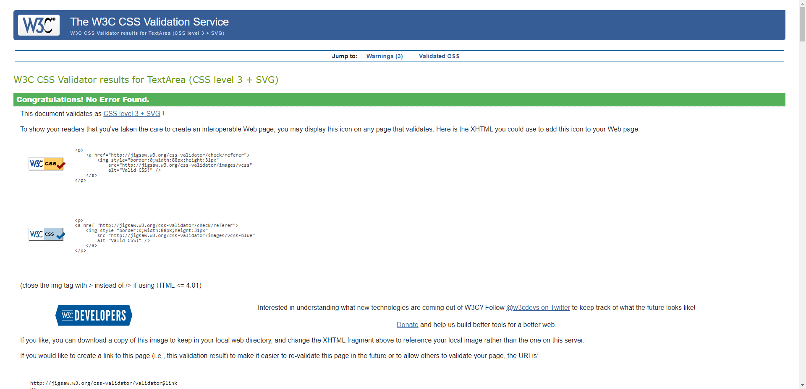
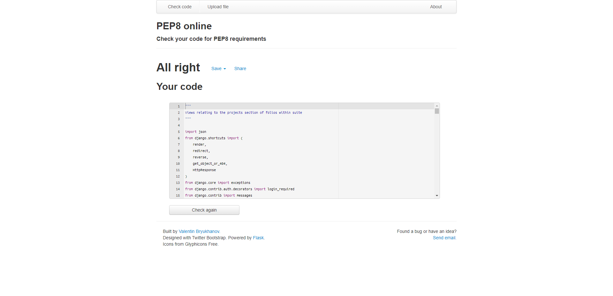
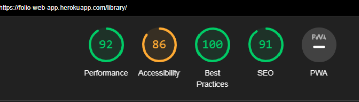

#  fol.io Testing

Within this markdown file, you'll find information regarding bugs, their fixes and the testing process of fol.io.

<a href="https://folio-web-app.herokuapp.com/" target="_blank">Link to live deployment of fol.io</a>

To navigate back to the README file, [click here](README.md).

## Contents

## User Stories

As a self-taught and aspiring developer, I want to be able to:

### Account Management

<details>
<summary>Register an account</summary>

When the user arrives on the home page, the register button is immediately presented at the top of the page. Although a register button exists within the hamburger menu for mobile and tablet devices, having the register button on the main helps make the process only 1 click.


After clicking the register button, the user is taken to the register page so they can make an account.


After making a successful account attempt, they're informed that an email has been sent to the email they've provided and they will see it in their inbox for that email.


After clicking the link within the inbox, they're re-directed to a page to confirm that the email address is indeed theirs.


Once confirming that it is indeed the case, they're told the account is created via a message and re-directed to the log in screen.


</details>

<details>
<summary>Log in to the account I've registered</summary>

When the user arrives at the home page, a log in button is immediately present to them both within the navigation and header section of the page.


When the user clicks the log in link, they're re-directed to the log in page where they can log in to the account they've registered.


</details>

<details>
<summary>Change my account details</summary>

When signed in, the user is presented the library page. From here, the user can click the account link within the navigation above to navigate to more account oriented pages, in which the account details page is immediately presented to them.


After making some changes to their account, they can then save the changes by clicking the save changes button on the page.


</details>

<details>
<summary>Reset the password of my account</summary>

When signed in, the user is presented the library page. From here, the user can click the account link within the navigation above to navigate to more account oriented pages, in which the account details page is immediately presented to them, which is where the reset password button happens to be.


After clicking this button, the user is presented the reset password page where they're able to enter their email to confirm that they want to reset their password.


After confirming with their email, the user is presented this confirmation page which tells that that they should expect a reset password email in their inbox soon.


After clicking the link within the email, they're directed to this page where they get to create their new password for their account.


After successfully created a new password, they're re-direct to a success page providing them links to either view the home page or log in.


</details>

<details>
<summary>See the amount of folio licences I have</summary>

When signed in, the user is presented the library page. From here, the user can immediately see the amount of licenses their account has.


</details>

<details>
<summary>Find information regarding previous license purchases I've made</summary>

When signed in, the user is presented the library page. From here, the user can click the license store link in the navigation, which directs the user to license purchase oriented pages.


After clicking on the link they land on the license purchase page. From here they can click the order history link that directs them to the order history page that contains all of their previous license purchases.


From here they can click the expand button for each license purchase to find out more information surrounding it.


</details>

### Folio Management

<details>
<summary>Create a brand new folio</summary>

When signed in, the user is presented the library page. From here, the user can click the new folio to create a new folio. Clicking this will open a create new folio modal.


After filling in all fields, the user can confirm the creation of the folio and see it immediately present within their library along with a confirmation message.


</details>

<details>
<summary>Edit an existing folio within my library</summary>

When signed in, the user is presented the library page. From here, the user can click the additional menu of any folio they choose and click Edit Details.


After they click edit details, they're shown the update folio modal which has the folio's existing data pre-filled within.


From here, the user can make the changes they'd like and click save changes, in which they'll then be re-direct to the library where they can see their changes to the folio reflected and be given a confirmation of changes message.


</details>

<details>
<summary>Toggle as to whether I want a folio to be viewable or not to the outside world</summary>

When signed in, the user is presented the library page. From here, the user can click the additional menu of any folio they choose and click Publish or Conceal.

Provided the user has enough licenses, clicking the Publish button will toggle the folio state and refresh the page in which the user can see their changes reflected along with a message.

Irrespective of the amount of folios the user has, if they click Conceal for a published folio, the folio is toggled to not published and it's reflected within the library page along with a message.

> Due to the screenshot application I'm using for this, it's not able to screenshot dropdowns as they close before a screenshot is taken. The dropdown and the edit details options mentioned are absolutely within the application.

- Before
    

- After
    

Notice also that the eye is change to the application's feature orange colour and that the toggle published state is also communicated to the user via the amount of licenses used above and a message that appears.

</details>

<details>
<summary>View the folio in it's live state despite being published or not</summary>

When signed in, the user is presented the library page. From here, the user can select the folio they'd like to open by clicking the folio's additional menu and selecting "open in suite", which will direct the user to the edit projects in folio suite page.


Once arriving at the edit projects in suite page, the user can click the view live button to view their folio in a live state regardless of it being published or not.


</details>

<details>
<summary>Delete a folio from my library</summary>

When signed in, the user is presented the library page. From here, the user can select the folio they'd like to delete, click the folio's additional menu and click the delete option within the menu.


This opens a modal to the user, which acts as warning in making sure that the user does indeed want to delete this particular folio.


If the user is confident that it's the folio they'd like to to delete, they can click the delete folio button and see their changes reflected on the library page along with a message informing them that the deletion was successful.


</details>

### Snippet Management

- Create snippets (that represent common portfolio sections) that can be re-used throughout my libary of folios.
- Select which snippets make it to each respective folio.
- Modify & update the content of a snippet within my collection.
- Delete a snippet from my collection.

### Billing

- Insert my billing details and have them be saved to my account.
- Select & change the amount of folio licences I'd like to purchase.
- Receive a confirmation e-mail confirming the purchase of folio licences.

As an employer interested in the developer, I want to be able to:

### Folio Viewing

- View a potential employee's folio.
- See what they're currently up to.
- Investigate what projects they've already created.
- Find out what skills they current posess.
- Discern what their future aspirations are.
- Promptly know how I can contact them.
- Message the author of the folio directly.

## Bugs

### Fixed

The following are bugs that I have dealt with & fixed.

#### (403) Forbidden CSRF Verification Failed

I encountered an issue when first logging into the Django admin console where it would present a 403 status code page, stating that the current URL did not match any of the trusted URL's.

<details>
<summary>Read Fix</summary>

After googling the issue, I found a couple of Stack Overflow answers that helped me understand the issue and what needed to be done in order to fix it. Those are listed here:

- https://stackoverflow.com/a/70572093/1560726
- https://stackoverflow.com/a/71194288/15607265

It seems that versions of Django that are 4 and above, require the <code>CSRF_TRUSTED_ORIGINS</code> setting within settings.py.

Once I inserted this setting within my settings.py file with my respective URL, the bug was fixed.

</details>

#### django.core.exceptions.ImproperlyConfigured: Application labels aren't unique

When adding the account app to the folio project, I encountered an issue where django would not accept applications with labels that are identical. It became apparent that naming an app 'account' was problematic due to an app already existing with that name (which I assume to be the allauth account app).

<details>

<summary>Read Fix</summary>

Numerous Stack Overflow posts were made regarding this problem in Django. The one's I found most helped were the following:

- https://stackoverflow.com/a/24319562/15607265
- https://stackoverflow.com/a/59377036/15607265

To fix this issue, the app itself needed to be configured using the __init__.py file. Within this file, using the AppConfig class provided by Django, the name & label of the app was changed so Django's loader would interpret it as unique. This can be seen below:

```python

    class AccountConfig(AppConfig):
        """
        Changes the label for this app as the account name already
        exists within django. Without this, django will throw an
        ImproperlyConfigured error.
        """
        name = 'account'
        label = 'folio_account'

```

To use this class, we then needed to inform Django that the default configuration for the account app is the AccountConfig class show above, using the DEFAULT_APP_CONFIG variable shown below:

```python

    DEFAULT_APP_CONFIG = 'account.__init__.AccountConfig'

```

With the app configuration completed, all that was left to do was to include this config file within the INSTALLED_APPS list within folio's settings.py file.

```python

    INSTALLED_APPS = [
        ...
        'account.__init__.AccountConfig'
        ...
    ]

```

</details>

#### Class "UserAccount" has no objects member

When referring to the UserAccount model and the objects within it, a linting error would appear informing me that the class doesn't contain an objects member.

<details>

<summary>Read Fix</summary>

Despite being a relatively minor problem as it was a linting issue, this was likely going to be a common error found within the linting reports. For this reason, I thought to fix it within the early stages of development.

The solution was found after reading over this Stack Overflow post:

- https://stackoverflow.com/questions/45135263/class-has-no-objects-member

The issue was promptly fixed after applying the following argument within the workspace settings:

```json

 "python.linting.pylintArgs": [
    "--load-plugins=pylint_django",
    ]

```

</details>

#### 403 Forbidden CSRF verification failed

When attempting to create an AJAX request that is involved with the saving of projects attached to a particular folio, the server would return with a 403 forbidden CSRF verification failed error.

<details>

<summary>Read Fix</summary>

After reading [this answer](https://stackoverflow.com/a/6170377/15607265) to a Stack Overflow post, I became aware of the fact that the CSRF middleware token had to be attached to the data within the request. The problem with this solution however was that it was using jQuery and I felt no need to add an entire JavaScript library to this project to complete this minor task.

During some more research, I came across [this answer](https://stackoverflow.com/a/66331048/15607265) to a Stack Overflow post which was more suited to my use case. Although jQuery was used again, this time the CSRF token was added to the header of the AJAX request, which is something I am able to do with standard JavaScript.

Using the request header code shown below, I was able to fix this issue.

```javascript

    const CSRF_TOKEN = document.querySelector('input[name="csrfmiddlewaretoken"]').value;
    request.setRequestHeader("X-CSRFToken", CSRF_TOKEN);

```

</details>

#### Project not being added to folio

When attempting to add a project to a folio, the change was not being made within the database.

<details>

<summary>Read Fix</summary>

In order to update the status of a folio being a parent to a project, a status of "is_attached" is sent to the server from the client-side via AJAX. The implementation of AJAX was utilised as forms currently exist for the projects for actions such as update & delete and using a form for the "is_attached" functionality would mean having forms within forms, which is not valid HTML.

The data being sent to the server was a list of projects containing the project's ID and an "is_attached" boolean value. It was the project's ID which was causing the problem, as it was being sent to the server as a string.

Further down the view, the list of projects was being sorted using the project ID as a key. Given it was a string rather than an int, it was not being sorted as intially intended. After applying the code below, the fix was made.

```python

    def sort_by_id(entity):
    """
    Returns the id of provided entity
    which can be used for sorting purposes
    """
    return int(entity['id'])

```

</details>

#### CSRF verification failed: Request aborted

After starting up the application server via Gitpod and submitting a form within the application, an error is presented informing me that the CSRF verifcation process has failed and that the request has been aborted.

<details>

<summary>Read Fix</summary>

When launching the project workspace via Gitpod, there's a chance that the URL given for a new Gitpod workspace session could be slightly different to the URL used in a previous workspace session.

This means that hard-coding the CSRF trusted origin would lead to problems, as the string provided would likely not match the URL given within the next Gitpod workspace session.

To fix this, the Gitpod workspace url environment variable was taken & partitioned into seperate sections. Inserting "*8000-" inbetween the "https://" and "kieran" partitions and combining the partions with f strings, meant that the CSRF trusted origin would be dynamically created and would match any given workspace session for this particular project.

Given that this is an issue that would only occur in development, this was also wrapped in an if statement to ensure this would only occur within e development environment.

The code that fixed this is provided below:

```python
    # CSRF
    if "DEVELOPMENT" in os.environ:

        url_partitions = os.environ.get('GITPOD_WORKSPACE_URL').partition('kieran')

        csrf_string = (
            f"{url_partitions[0]}*8000-"
            f"{url_partitions[1]}{url_partitions[2]}"
        )

        CSRF_TRUSTED_ORIGINS = [(csrf_string)]

```

</details>

#### Heroku Error: Items could not be retrieved, Internal server error

When attempting to connect my GitHub account to Heroku so I could assign the Heroku app to folio's GitHub repository, instead of providing me with a list of my GitHub repositories, Heroku threw an error stating "Items could not be retrieved, Internal server error".

<details>

<summary>Read Fix</summary>

After researching the error being given, it was clear after reading [this Stack Overflow answer](https://stackoverflow.com/a/71895325/15607265) that the GitHub connect feature was temporarily disabled due to a security breach. As the answer suggests, the fix was to use the Heroku CLI instead.

[This Stack Overflow answer](https://stackoverflow.com/a/71905270/15607265) tremendously helped in quickly getting the Heroku CLI up and running with the git repository.

Although other bugs presented themselves after this, the error in which the repo could not communicate with Heroku was now fixed.

</details>

#### ERROR: Could not build wheels for backports.zoneinfo...

Despite now having communication with Heroku via their CLI, the build attempts by Heroku were failing due to a backports.zoneinfo related issue. After reading [this Stack Overflow answer](https://stackoverflow.com/a/71735458/15607265), it was clear that the version of Python that Heroku installs by default was not working with the folio codebase.

<details>

<summary>Read Fix</summary>

To rectify the issue according to [this Heroku article](https://devcenter.heroku.com/articles/python-runtimes), a runtime.txt file containing a specified version of Python was required, to inform Heroku as to which version of Python it should install instead. To find out the particular version of Python I was working with, I entered <code>python -V</code> within the console which gave the following result:

```bash
python-3.8.11
```

Inserting this within the runtime.txt file rectified the issue after adding and commiting the file the repository.

</details>

#### No Folios match the given query

When the user has no folios within their account and they attempt to view their folio library, django provides a query related error where "No Folios match the given query".

<details>

<summary>Read Fix</summary>

After researching this error online, it became apparent that it was an obvious user error on my part. This was due to the use of the get_list_or_404 shortcut function to retrieve folios. If no folios were found with the given query, it would throw an error which was not the intended functionality.

To resolve this issue, it was simply replacing the get_list_or_404 function with the following syntax:

```python
folios = Folio.objects.filter(author_id=request.user)
```

</details>

#### No 'Access-Control-Allow-Origin' header is present on the requested resource

When viewing the deployed app on Heroku, certain JavaScript based functionality was not working due to the base.js file not being loaded in properly. According to the browser console, it was a CORS related issue where a required header was missing.

<details>

<summary>Read Fix</summary>

After researching this issue, numerous fixes were presented including the use of django-cors middleware to attach CORS headers to files. These fixes didn't work in my case however.

What I found puzzling was that over JavaScript files were being loaded in fine, however the base.js file was not. Due to this, I investigated the codebase and noticed I had accidently left the attribute of type="module" within the script tag that was loading base.js. After removing this attribute, the problem was fixed.

</details>

#### Navbar was wider than html body & overflow-x wasn't working on mobile devices

When looking at the site via the mobile device viewer on Google Chrome, the viewport could be moved slightly to the right which was un-intentional in fol.io's design. Along with the unexpected behaviour of being able to slightly shift the viewport to the right, the elements on the page weren't positioned correctly.

<details>

<summary>Read Fix</summary>

Attempts at fixing this with CSS classes in Bootstrap 5 and other CSS workarounds found through Stack Overflow, did not provide the desired outcome in fixing the max width of certain elements to the width of the body element.

The fix however did come to light via [this Stack Overflow answer](https://stackoverflow.com/a/41407863/15607265) which suggests the inclusion of "user-scalable=no" within the viewport meta tag. After making this change, the elements flowed and fitted on the page as expected.

</details>

#### Pylint - Django was not configured error

For each page, a pylint error was present at the top of the page during a GitPod session. Although this had little to no effect on the project itself, from a testing staandpoint it was distracting.

<details>

<summary>Read Fix</summary>

In order to solve this problem, after reading [this Stack Overflow answer](https://stackoverflow.com/a/68346742/15607265), it became clear that a .pylintrc file was needed.

After creating the file and inserting the pylint commands found within the Stack Overflow answer, this soon resolved the issue and allowed me to focus on certain files with legitimate errors.

The commands can be found below:

```
[MASTER]
load-plugins=pylint_django
django-settings-module=fol.io.settings
```

</details>

#### Character count too long (100)

After realising that the character count for various descriptions within models needed to be increased, the changes were made and migrated with no issue on the development server. However, an error was occuring on Heroku when submitting a new snippet to the database as the description lengths were too long.

<details>

<summary>Read Fix</summary>

It was self explanatory that it was migration-based on the Heroku deployment side and after looking at [this Stack Overflow post](https://stackoverflow.com/a/54793985/15607265), it provided a helpful way in getting the fix sorted promptly.

After performing the following commands below, the issue was fixed.

```bash
heroku run python manage.py migrate suite zero
heroku push heroku main
heroku run python manage.py migrate
```

</details>

#### Duplicate id's

As I'm using various models containing their respective forms for various objects, after looking through the HTML validator it became clear that a problem had arisen where an object such as a folio had an "update_folio" model with the same id as an "update_folio" from another folio.

<details>

<summary>Read Fix</summary>

A fix for this was making use of the prefix feature within django that allows a user to prefix the id's within forms, in this example specifically, folio update forms.

```python
for folio in folios:
    folio.form = CreateFolioForm(
        instance=folio,
        prefix=f"folio-{folio.id}"
    )
```

Using this meant that each folio model had an individual id and was not causing any errors regarding HTML validation. One problem this did mean however was the prefixes meant that the forms were no longer valid when being submitted to the server.

After looking at [this Stack Overflow answer](https://stackoverflow.com/a/22210263/15607265), a good option was to make a copy of the query dictionary and add to it the required fields by the form (in this case "name" and "description") which enabled the form to be valid. Although this feels like a hack, due to time constriants this was the best option unfortunately. The copy of the query dictionary can be seen below:

```python
post = request.POST.copy()
    post['name'] = post[f"folio-{folio_id}-name"]
    post['description'] = post[f"folio-{folio_id}-description"]
    form = CreateFolioForm(post, instance=folio_in_db)
```

</details>

#### No log in error messages

Despite error messages automatically appearing on the registration page from allauth, it was not performing the same behaviour for the login page.

<details>
<summary>Read Fix</summary>

After reading [this Stack Overflow answer](https://stackoverflow.com/a/24273898/15607265), it became apparent that it was a non-field error which meant that the errors were appearing elsewhere in the form object. It was simply a case of looping through the errors within each field for the form and presenting them in a design similar to what was being presented within the registration page.

```html

    
        
            <p class="text-danger small"><strong>{{ error|escape }}</strong></p>
        
    
        
            <p class="text-danger small"><strong>{{ error|escape }}</strong></p>
        

```

</details>

### Known

The following are bugs that are still present within the current build of fol.io. Attempts to resolve these bugs will be made after the MVP release of the application.

- Order history page - The titles of previous license purchases within the order history page do not clamp down. Instead they go onto the next line and therefore vertically expands the card header section of the license purchase. This is due to the order number acting as one large "word" and clamp.js not having the ability (to my knowledge) to break down the order number so it can be clamped.
- When uploading an image to the application, the imagefield doesn't immediately indicate that an image has been provided. It only presents this after refreshing the page. I spent some time attempting to fix this with solutions such as adding a sleep timer to ensure the file was uploaded amongst many others. in which none provided the desired outcome. Due to time constraints I had to withdraw from solving this bug for now, however it is something I intend to fix in the future. For the time being, a message is presented to the user informing them that if they don't see the changes being reflected, they can click a link that refreshes the current page. Although this isn't ideal, I felt it was important to be transpents to the user and help them with the problem. This seems to only be a problem with the account details page also.

## User Testing

To help with the user friendiness of fol.io, I decided to conduct a user test where I handed fol.io to a family member who's tech-savvy (whom I will call tester from now on) and asked them to perform a set of tasks within the site. Although it could be considered more appropriate to put this in front of someone such as a web developer, I thought it was useful to put this in front of someone who is only vaguely familiar with programming, as it would better challenge how well the application informed it's user as to what to do next. The thinking was, if someone who has a general idea on development can get around the application, a web developer or at least someone of that calibre in their understanding of tech would certainly understand the application.

What was clear when first looking at the site, was that the general concept of the application was not being communicated well to the tester. They were initially confused by the suite and the naming of it. It wasn't clear to them what the functionality for this portion of the app was for. Only when I explained the suite app in a different light, did they begin to understand the functionalityi that it provided. With this in mind, I started from square one in terms of the word content presented within the home page as this is the opportunity to inform the user as to what fol.io contains. Myself and the tester agreed that directly addressing the apps by name (such as Suite, Library, License Store) alongside the functionality they could provide helped communicate the concept of the application better.

Another problem that the tester observed was the inconcistency in language regarding particular entities found within the application. An example of which is alternating between "profiles" and "profile snippets" which is absolutely understandable. With this in mind, during the later portion of development, a consistent effort was made to present concepts and entites within fol.io in a consistent manner to make it easier to explain. THese changes will hopefully makie the learning process whilst learning fol.io easier than it was previously.

One issue that was also raised was the lack of guidance when a folio didn't contain any content for a respective reason. This could include a name not being presented or a default profile picture being shown. The tester recommended that rather than informing the user of a problem, it would be better to be directed to the source of the problem and given guidance as to how to fix it. I agreed with the tester's comments, however the trouble of time became a greater issue and given that it was a nice to have rather than an absolutely necessary piece of functionality, it was placed on the "if time allows" to-do list. It's definitely a feature that should appear in a future release of fol.io.

## File Validation

### HTML

To assess the validity of the html pages contained within the application, the following steps were taken for each page listed below:

1. Open the page on a live server
1. Press <kbd>CTRL</kbd> + <KBD>U</KBD> to get the source code from the browser.
1. Select & copy all of the code presented within the page.
1. Paste & enter the copied code within the direct input field found within the [W3C Markup Validation Service](https://validator.w3.org/#validate_by_input) tool.

Performing the previously mentioned steps on the the following pages provided positive results. One exception found throughout was a warning regarding the user-scalable attribute within a html meta tag. This is found throughout due to it's presence on the base templates.

After observing the warning and experimenting with alternatives, I decided to stick with the attribute being present within the base templates as alternative strategies didn't provide results I was happy with. Also time constraints were becoming a bigger problem at the time and it was decided that it would be best to address this issue at a later date.

For accurate validation results, it was also made sure that various folios and snippets were present on the respective pages prior to extracting the source code and validating it. 

#### Home

The validation results for the home app can be found below:

<details>
<summary>Welcome page results</summary>

</details>

#### Library

The validation results for the library app can be found below:

<details>
<summary>Library page results</summary>

</details>

#### Suite

The validation results for the suite app can be found below:

<details>
<summary>Suite projects page results</summary>

</details>

<details>
<summary>Suite skills page results</summary>

</details>

<details>
<summary>Suite profile page results</summary>

</details>

#### Showcase

The validation results for the showcase app can be found below:

<details>
<summary>Showcase projects page results</summary>

</details>

<details>
<summary>Showcase skills page results</summary>

</details>

<details>
<summary>Showcase profile page results</summary>

</details>

<details>
<summary>Showcase contact page results</summary>

</details>

#### License

The validation results for the license app can be found below:

<details>
<summary>License purchase page results</summary>

</details>

<details>
<summary>Order history page results</summary>

</details>

#### Account

The validation results for the account app can be found below:

<details>
<summary>Account details page results</summary>

</details>

<details>
<summary>Billing details page results</summary>

</details>

### CSS

Below you will find the results for the CSS validation results for the base.css file that is shared amongst all html pages within the application. The source code was directly copied from the IDE and pasted within the direct input field found within the [W3C CSS Validation Service](https://jigsaw.w3.org/css-validator/#validate_by_input) tool.

<details>

<summary>View CSS Results</summary>



</details>

Despite the positive result, there were 3 warnings given regarding web prefixes:

<details>

<summary>View CSS Warnings</summary>


</details>

Given that this is intentional for webkit supported browsers to make the application more aesthetically pleasing, this was not deemed an issue for the application.

### JavaScript

Below you will find the results for the JS validation results for the custom JavaScript files within the application. The source code was directly copied from the IDE and pasted within the direct input field found within the [JSHint](https://jshint.com/) tool.

> clamp.min.js is not an original custom JavaScript file, therefore it was not validated for this project.

<details>
<summary>View base.js results</summary>

The results came back positive with only one warning present and a couple of unused/undefined variables respectively.


The warning was regarding a ternary operator expression that wasn't being used to assign to a variable, but instead was simply used as a simply if/else statement. After understanding this minor warning, I changed the ternary operator expression to a simple if/else which cleared the warning as is shown below:


Regarding the undefined/unused variables, they happen to both be from the code that was directly taken from the Bootstrap website. Given that the code works and it's what Bootstrap themselves recommend, I decided to not take any action towards solving these minor concerns.
</details>

<details>
<summary>View purchase.js results</summary>

The results came back positive with only one warning which happens to the same warning found within the base.js file, regarding a ternary operator being used as a simple if/else expression rather than a way to assign an expressions result to a variable.


After changing the ternary operator to a simple if/else statement, the warning was resolved.


</details>

<details>
<summary>View project-snippets.js results</summary>

The results came back positive for the project-snippets.js with no warnings present after making some last minute adjustments prior to testing it's validation.


</details>

<details>
<summary>View skill-profile-snippets.js results</summary>

The only warnings that were present during the validation process of this file was semi-colons. After adding the missing semi-colons, the validation result came back entirely positive as can be seen below:


</details>

### Python

Pylint and Pep8 linters within Gitpod were used during the development of the application in checking that the python files were valid and are all void of any warnings/errors. However for good measure, the more complex python files within the application were validated using the [PEP8 Online](http://pep8online.com/) validator to make sure that this objectively was the case. These all came back positively and matched the validations made within the IDE python linters.

<details>
<summary>View validation results the for the project views python file within the suite app</summary>

</details>

<details>
<summary>View validation results the for the models python file within the suite app</summary>

</details>

<details>
<summary>View validation results the for the webhook handler python file within the license app</summary>

</details>

## Defensive Programming

Following conventional web development standards, all sensitive information such as id's and keys are kept hidden from source control. This was achieved with the use of Gitpod's environment variables feature and the config variables that are found within the settings tab of the Heroku app.

"Internal" pages all require a logged in session. This is achieved via the use of django's allauth middleware that comes pre-packaged with the python framework. Without this session, the user is re-directed to the log-in page or is presented a custom made error page that fits the design of fol.io and also provides functionality that takes the user back to a reasonable place within the application.

All views that are directly linked to the management of objects stored within the database can only be managed if the current user is the "author" of the object. This is to protect the potential case where one could delete or modify another user's folio or project/skill/profile snippet without being the author.

## Testing Functionality

### Test Driven Development

Regarding Test Driven Development, although the methodology wasn't carried out strictly by it's definition (due to my lack of understanding on the topic), testing was continually conducted when new features were being developed. Examples of this include purposefully triggering invalid statuses within forms to be given useful messages as outcomes and testing features when deployed on Heroku, such as the image upload feature for projects, as AWS was being used in deployment instead of the directory itself which is what's used in the development environment. When time was more available during the development of the application, automated tests were being conducted to assert that certain outcomes were being met by models, forms and views within the application. Despite automated testing not being conducted on the whole application, it is something I intend on doing in order to fully understand the testing process and become more fluent with the methodology.

### Automated Testing

Automated unit testing had been conducted during the development of fol.io. However due to time constraints, I opted to abandon automated testing for manual testing as it's more time efficient due to me being more familiar with it after testing previous projects. This is something I'll take onboard in future projects as I was surprised to see how long unit tested could take when done properly.

> What also contributed in pushing me towards that decision was an accouncement within Code Institute's slack, which stated that the criteria for the 4th project had been updated to allow the implementation of manual and/or automated test procedures.

Evidence of the presence of automated testing can be seen within the following app's directories:
- Account
- Home
- Library

### Manual Testing

The following manual tests were conducted on every page within the application to test that the intended functionality for each page was working as expected.

#### Navigations

##### External Nav Links

This is regarding the nav links are presented when the user is not authenticated.
- Log in link directs the user to the log in page.
- Register link directs the user to the register page.

##### Interal Nav Links

This is regarding the nav links are presented when the user is authenticated.
- Suite link is dynamic depending on the user's latest folio status as intended. It directs the user to the suite if a latest folio cookie exists, otherwise it takes the user to the page where they decide what folio to open within the suite.
- The library link directs the user to their library as intended.
- The license store directs the user to the license purchase screen within the license app as intended.
- The account link directs the user to the account details page view within the account app as intended.
- The log out button logs the currently authenticated user out as intended.

##### Showcase Nav Links

This is regarding the navigation that is displayed if a user is authenticated and is viewing a folio.
- Return to suite link directs the user back to the suite projects page as intended. If an autheticated user clicks this while viewing another user's published folio, the authenticated user is re-directed to the select folio page within the suite as intended.
- The log out button logs the currently authenticated user out as intended.

##### Footer Links

This is regarding the links found within the footer of every page.
- All direct the user to their intended website destinations within a new tab.

#### Home App / Authentication

##### Home 

- The log in button within header section directs the user to the log in page if not already authenticated which is expected behaviour. It also directs the user to their library if they're already authenticated.
- The register button within the header section directs the user to the register page if not already autheticated and directs authenticated uers to their library which is expected behaviour.
- Help section opens and closes on click as intended.
- Hover transitions for buttons all work as intended.
- Page content and images animate onto the page as expected.

##### Log in Page

- Log in is presented as the active tab within the navigation as expected.
- Log in is presented as the currently viewed tab within the header as intended.
- Sign up link directs the user to the registration page as expected.
- The forgot password directs the user to the forgot password page as expected.
- The page does not have a help section as intended.
- Email validator checks for correct email format as expected.

##### Register Page

- Sign in link directs the user to the sign in page as expected.
- Register is presented as the currently viewed tab within the header as intended.
- Email validator checks for correct email format as expected.
- Email validation that a user doesn't already exist with the given email.
- Username validation that a user doesn't already exist with the provided username.

#### Library App

##### Library Page

- Help section opens and closes on click as intended.
- Library is presented as the active page within the navigation.
- Names and descriptions are clamped for symmetrical visuals as intended.
- Publish link is displayed within a folio's additional menu if that folio is not published which is expected behaviour.
- Conceal link is displayed within a folio's additional menu if that folio is published which is intended.
- Link to license purchase screen appears near the total number of licenses if total amount of licenses is equal to 0 and re-directs the user to the license purchase screen as intended.
- Message to inform the user to create a folio is presented when they have no folios within their library.
- Message to inform the user to create snippets for their new folio or purchase a license is presented when the user has only 1 folio within their library. This is the expected behaviour. Links to the suite and license purchase pages within the message works as intended also.
- List of folios is scrollable once the amount of license purchases get too large for the screen which is the intended behaviour.
- Folio's are sorted by the date in which they were created which is the expected behaviour.

- Creating a folio
    - Validation that both fields are required works as intended.
    - Clicking CREATE creates folio, stays on library page and informs the user as intended.
    - Clicking CREATE AND OPEN IN SUITE creates the folio, opens it within the suite and informs the user as expected.
- Updating a folio
    - Folio's current fields are pre-filled within form for convencience as intended.
    - Clicking UPDATE updates a folio's data, stays on te library page and informs the user as intended.
    - Clicking UPDATE updates a folio's data, re-directs the user to the suite projects page and informs the user as intended.
- Toggling a folio's published state
    - If a user has no licenses, clicking the Publish button within the folio's dropdown menu will direct the user to the license purchase screen with a message informing them to but a license as expected.
    - If a user has enough licenses, clicking the Publish button within the folio's dropdown menu will toggle the folio's published state to true, reload the library page, inform the user of the folio's published state change and show a coloured icon to represent it being published.
    - Clicking the Conceal button , toggles the folio's published state to false, reloads the library page, informs the user of the folio's published state change and shows a white hidden eye icon to represent the folio being concealed.
    - The total amount of licenses used updates as expected when a folio is either published or concealed.
- Deleting a folio
    - Following defensive programming standards, when a user clicks Delete within a folio's additional menu, a modal is displayed to the user making sure that they want to proceed with deleting the folio.
    - Clicking DELETE deletes the folio, reloads the library page and informs the user of the deletion as intended.

#### Suite App

##### Select Folio Page

- Page is skipped provided a latest cookie is stored within the user's browser which is the intended behaviour.
- Suite is presented as the current app the user is located within in the navigation, which is the expected behaviour as this page is part of the Suite app.
- If the current user is not the author of the latest folio stored within the browser, the user is re-direct to the select folio page with a message informing them that the browser has now forgotten the latest folio opened as they're not the author of the folio. This is the expected behaviour and is designed to protect a user's folio.
- If the user has no folios within their library, they cannot access this page which is to be expected. They're re-directed to the library page which a message informing them to create a folio to access the suite.
- The user's list of folios is presented within a select box as expected.
- Clicking OPEN IN SUITE will open the suite with the folio selected within the select box on the page which is the expected behaviour.

##### Projects Page

- Suite is presented as the current app the user is located within in the navigation, which is the expected behaviour as this page is part of the Suite app.
- Projects is presented as the currently viewed tab within the suite app as intended.
- Click functions for help section works as expected and contains information that's specific to the projects page within the suite app.
- The folio's name is presented within the header section of the app.
- The folio's published state correctly reflects the folio's current published state.
- Hovering over the folio's published state icon tells the user what it means, which is the expected behaviour and it provides a way communicate further information to the user in an interactive way.
- The VIEW LIVE link re-directs the user to the showcase view of the folio and specifically directs the user to the projects page as it's the projects they were originally on. It also opens the folio within the showcase app in a new tab so the user can jump between editing and viewing their folio projects.
- List of projects becomes a scrollable container when the amount of projects exceed the height of the container which is the expected behaviour.

- Create project
    - The create project form is shown when CREATE PROJECT is clicked which is the expected behaviour.
    - Project title, description and tech list are provided as required fields as expected. The user cannot create a project without these fields being filled with content which is what's intended.
    - Expected placeholders are displayed and the URL placeholders guide the user as to what URL's are expected when providing one within the form.
    - Clicking CREATE PROJECT creates a project provided the required fields are given which is to be expected. The user is then re-directed to the projects page with their new project being presented and a message informing them that they've created a new project.

- Update project
    - The create project form is shown when Edit is clicked within a project's additional menu which is the expected behaviour.
    - Project title, description and tech list are provided as required fields as expected. The user cannot update a project without these fields being filled with content which is what's intended.
    - If fields have not been auto-filled by data taken from the database, expected placeholders are displayed to the user.
    - Providing that the required fields have been fulfilled, clicking SAVE CHANGES updates the currently viewed project with data supplied within the form, re-directs the user to the projects page and informs them that the changes have been made successfully.
    - Checking clear data and clicking SAVE CHANGES within the update project form removes the image attached to the project which is what's intended. 
    - Uploading an image whilst an image is already attached to the project, replaces the existing image with the new one provided. This is the expected behaviour and is immediately reflected after saving the changes and looking at the edit form afterwards.

- Selecting projects
    - Amount of projects selected is presented to the user and is dyanamic to the amount of projects checked on the page.
    - If 4 projects are checked on the page, all other checkboxes are disabled and cannot be additionally selected. This is the expected behaviour and is utilised in order to limit the user to only 4 projects, as it meets the convnentional amount of projects you typically see in modern day portfolios.
    - If a user unchecks a project from their folio, bringing their total selected projects from 4 to 3, all disabled checkboxes are now enabled again to allow the user to add a different project to their folio. This is the expected behaviour and the current implementation achieves it's intentions.
    - Clicking SAVE CHANGES, takes the currently checked projects on the page and adds them to the folio which is the expected behaviour. After this is done, the user is then re-directed back to the projects page within the Suite app and informed via a message that the projects attached to the folio have been updated successfully.

- Deleting projects
    - Following defensive programming standards, clicking delete within a project's additional menu provides a model making sure that the user does want to proceed in deleting the project in question. The model also displays the project's name to the user, giving them extra security in making sure it's that particular project that they want to delete.
    - Clicking DELETE PROJECT within a project's delete form, will delete that project from the database, re-direct the user to the projects page within the suite and provide a handy message to inform them that the deletion was successful.

##### Skills Page

- Suite is presented as the current app the user is located within in the navigation, which is the expected behaviour as the skills page is part of the Suite app.
- Skills is presented as the currently viewed tab within the suite app as intended.
- Click functions for help section works as expected and contains information that's specific to the skills page within the suite app.
- The folio's name is presented within the header section of the app.
- The folio's published state correctly reflects the folio's current published state.
- Hovering over the folio's published state icon tells the user what it means, which is the expected behaviour and it provides a way communicate further information to the user in an interactive way.
- The VIEW LIVE link re-directs the user to the showcase view of the folio and specifically directs the user to the skills page as it's the skills page that they were originally on in the Suite app. It also opens the folio within the showcase app in a new tab so the user can jump between editing and viewing their folio skills.
- List of skills becomes a scrollable container when the amount of skills exceed the height of the container which is the expected behaviour.

- Create skill
    - The create skill form is shown when CREATE skill is clicked which is what's intended.
    - All fields being the skill title, description and type are provided as required fields as expected. The user cannot create a skill without these fields being filled with content which is what's intended.
    - The skill type field is always a select element with only soft skills and tech skill as options which is the expected behaviour.
    - Expected placeholders (except for the skill type) are displayed to the user.
    - Clicking CREATE SKILL creates a new skill and the option selected within the select box dictates as to what skill it is. The user is then re-directed to the skills page with their new skill being presented within it's correct skill type list and a message appears, informing them that they've created a new skill.

- Update skill
    - The create skill form is shown when Edit is clicked within a skill's additional menu which is the expected behaviour.
    - skill title, description and tech list are provided as required fields as expected. The user cannot update a skill without these fields being filled with content which is what's intended.
    - Providing that the required fields have been fulfilled, clicking SAVE CHANGES updates the currently viewed skill with data supplied within the form, this includes the ablity to change a skill's type from soft to tech. The user is then re-directed back to the skills page within the Suite app, where the skills can be seen within it's correct skill type section and a message is provided informing the user of the update being successful.

- Selecting skills
    - Amount of skills selected is presented to the user and is dyanamic to the amount of all skills checked on the page. This ignores whether the skill is a soft or tech skill and simply sums the total amount of skills checked on the page.
    - Clicking SAVE CHANGES, collects all of the checked skills and adds them to the folio which is the expected behaviour. When this is done, the user is re-directed to the skills page within the suite app along with a message informing that the skills attached to the folio have been updated successfully.

- Deleting skills
    - Following typical defensive programming protocols, clicking delete within a skill's additional menu provides a model making sure that the user does want to proceed in deleting the skill they've selected.
    - The model also contains the name of the skill to help make sure that the user does indeed want to delete the skill they've currently selected.
    - Clicking DELETE skill within a skill's delete form, will delete that skill from the database, re-direct the user to the skills page within the suite and provide a handy message to inform them that the deletion was successful.

##### Profile Page

- Suite is presented as the current app the user is located within in the navigation, which is the expected behaviour as the profile page is part of the Suite app.
- Profile is presented as the currently viewed tab within the suite app as intended.
- Click functions for help section works as expected and contains information that's specific to the skills page within the suite app.
- The folio's name is presented within the header section of the app.
- The folio's published state correctly reflects the folio's current published state.
- Hovering over the folio's published state icon tells the user what it means, which is the expected behaviour and it provides a way communicate further information to the user in an interactive way.
- The VIEW LIVE link re-directs the user to the showcase view of the folio and specifically directs the user to the profile page as it's the profile page that they were originally on in the Suite app. It also opens the folio within the showcase app in a new tab so the user can jump between editing and viewing their folio profile.
- List of profiles becomes a scrollable container when the amount of folio's exceed the height of the container which is the expected behaviour.

- Create profile
    - The create profile form is shown when CREATE profile is clicked which is what's intended.
    - All fields being the profile title and description are provided as required fields as expected. The user cannot create a profile without these fields being filled with content which is what's intended.
    - Expected placeholders to help guide the user are displayed to the user.
    - Clicking CREATE profile creates a new profile and the option selected within the select box dictates as to what profile it is. The user is then re-directed to the profiles page with their new profile being presented within it's correct profile type list and a message appears, informing them that they've created a new profile.

- Update profile
    - The create profile form is shown when Edit is clicked within a profile's additional menu which is the expected behaviour.
    - Profile title & description are provided as required fields as expected. The user cannot update a profile without these fields being filled with content which is what's intended.
    - Providing that the required fields have been fulfilled, clicking SAVE CHANGES updates the currently viewed profile with data supplied within the form. When update is complete, the user is then re-directed back to the profiles page within the Suite app and a message is provided informing the user that the update has being successful.

- Selecting profiles
    - Amount of profiles selected is presented to the user and is dyanamic to the amount of profiles checked on the page.
    - Clicking SAVE CHANGES, collects all of the checked profiles and adds them to the folio which is the expected behaviour. When this is done, the user is re-directed to the profiles page within the suite app along with a message informing that the profiles attached to the folio have been updated successfully.

- Deleting profiles
    - With defensive programming protocols in mind, clicking delete within a profile's additional menu provides a model making sure that the user does want to proceed in deleting the profile they've currently selected.
    - The model also contains the name of the profile. This helps make sure that user is sure that it's that particular profile that they wish to delete.
    - Clicking DELETE PROFILE within a profile's delete form, will delete that profile from the database, re-direct the user to the profiles page within the suite and provide a handy message to inform them that the deletion was successful.

- Updating the current project/future goal form
    - Provided no data has been brought back from the database, the fields present placeholders that act as guidance for the user which is the expected behaviour.
    - Neither is required, so the user can update the fields they wish which is the intended behaviour.
    - The current project URL field validates the input prior to form submission as expected, making sure that the URL provided fits the URL format. The placeholder also acts as a handy helper to help guide the user as to what the URL should start with.
    - Clicking the SAVE CHANGES button underneath the fields, will update the folio's current project and future goal fields, re-direct the user to the same page with the changes being reflected with the form and a handy message informing them that the change has been successfully made.

#### Showcase App

##### Header

- Authenticated
    - No matter if the user is the author of the folio or not, if a registered user clicks a warning link that's displayed when a field is missing within the header, namely the default profile picture or name, the user is re-directed to the account details page for their OWN account. Any changes they make within the account details page will only affect their own account which is the expected behaviour.

- Not authenticated
    - If an un-registered user clicks either of the profile picture or name warning links within the header, they are re-directed to the log-in screen.

##### Projects Page

- Authenticated
    - Navigation presents return to suite and LOG OUT links when signed in which is the expected behaviour.
    - If the author of the folio is looking at this page, the link within the no projects attached message re-directs the user to the edit projects page within the suite app which is expected.
    - If the person logged in is not the author of the folio but is authenticated with a different account, the link within the no projects attached message re-directs the user to the select folio screen and informs them via a message that they cannot interact with folios that are not their own.
    - If the user logged in is not the author of the folio and clicks either one of the add links that appear when a link has not been provided for a project, it directs them to the select folio page and informs them that they cannot interact with folios that are not their own.

- Not authenticated
    - Navigation presents log in and REGISTER links when not signed in which is expected.
    - If an un-registered user clicks the link within the "no projects" message, they are re-directed to the log-in screen.

- Projects is displayed as the active tab within the showcase view as intended.
- If there are no projects attached, a message is presented to the user encouraging them to attach projects to the folio currently being viewed.
- Displayed data for projects are clamped for visual concistency on page.
- Icon button in project card header opens the project to view it in more detail via a model. This is where users can read more about a project meaning the clamp functionality is disabled, which works as intended.
- Provided links have been given for the projects, they direct the user to the intended destination within a new tab as expected and visually indicated.
- Provided the user follows the guidelines in uploading images that have an aspect ratio of 16:9, they load and are presented exactly as intended.
- Projects are presented in two columns on desktops and one for mobile as intended.

##### Skills Page

- Authenticated
    - Navigation presents return to suite and LOG OUT links when signed in which is the expected behaviour.
    - If the author of the folio is looking at this page, the links within both of the no skills attached messages re-directs the user to the edit skills page within the suite app, which is expected.
    - If the person logged in is not the author of the folio but is authenticated with a different account, both links within the no skills attached messages re-directs the user to the select folio screen and informs them via a message that they cannot interact with folios that are not their own.

- Not authenticated
    - Navigation presents log in and REGISTER links when not signed in which is expected.
    - If an un-registered user clicks either one of the links within the "no skills" messages, they are re-directed to the log-in screen.

- Skills is displayed as the active tab within the showcase view as intended.
- If there are no skills attached for either skill type within the folio, a message is presented for each skill type respectively to the user encouraging them to attach skills to the folio currently being viewed.
- When skills are attached to the folio, they are presented simply as a header title and paragraph body which is segregated from other skills with the horizontal line as expected.
- Two columns on desktop screens slowly transition to a single column for mobile screens as expected.

##### Profile Page

- Authenticated
    - Navigation presents return to suite and LOG OUT links when signed in which is the expected behaviour.
    - If the user logged in is not the author of the currently published and viewed folio, clicking the link that appears in the "no projects are attached to this folio" message directs the user to the select folio page and informs them via a message that they cannot interact with folios that are not their own. This is also the case for the "add one here" links that appear when current project & future goal data has not been inserted within the folio profile.
    - If the user logged in is the author of the folio & logged in, the "add on here" links direct them to edit folio profile page within the suite as expected.

- Not authenticated
    - Navigation presents log in and REGISTER links when not signed in which is expected.
    - If an un-registered user clicks the link within the "no projects" message, they are re-directed to the log-in screen.
    - If an un-registered user clicks any of the "add one here" links for information that's not given within the folio, they're re-directed to the log in page.

- Profile is displayed as the active tab within the showcase view as intended.
- If there are no profile snippets attached to the folio, a message is presented to the user encouraging them to attach profiles to the folio currently being viewed.
- Provided a link has been provided, the current project link re-directs the user to the intended destination which is the expected behaviour.

##### Contact Page

- Authenticated
    - Navigation presents return to suite and LOG OUT links when signed in which is the expected behaviour.
    - No matter if the user is the author of the folio or not, if a registered user clicks a warning link that's displayed when a field is missing within the contact page such as a mobile number or the social media links, the user is re-directed to the account details page for their OWN account. Any changes they make within the account details page will only affect their own account which is the expected behaviour.

- Not authenticated
    - Navigation did not initially present the log in and REGISTER links, as it initially displayed the return to suite and REGISTER links which was not intended. The problem was quickly understood and resolved and now the navigation presents the log in and REGISTER links when not signed in which is the expected behaviour.
    - If an un-registered user clicks any of the "Add" links for information that's not given within the contact page of the folio, they're re-directed to the log in page.

- Provided a phone number has been provided within the user's account, clicking it initiates a call attempt depending on what device the user is currently on. This is the intended behaviour.
- Clicking the email address link re-directs their device email service and sets up a new email using the folio author's email as the email recipient.
- Provided link's have been inserted into the user's account within the correct format, the github and linkedin links direct the user to their respective destinations within a new tab which is the expected behaviour.
- Fields within the message form are all required before the user can submit a message as intended.
- The contact the author messaging system works, where an email is sent to the folio author's email address and looks as expected.
- When the user sends a message to the folio author, the page is refreshed and they're provided a message informing them that their message has been sent to the author of the folio.

#### License App

##### License Purchase Page

- Help section opens and closes when clicked as intended. Links within the help section re-direct the user to their intended destinations as expected.
- License purchase is presented as the currently viewed tab within the license app as intended.
- License is presented as the current app the user is located within in the navigation, which is the expected behaviour as this page is part of the License app.
- The submit button can only be submitted if the number of licenses is 1 or more. If it's below 1, the submit button will be disabled as intended.
- All fields except for the save billing details checkbox need to be filled before moving on to Stripe which is expected behaviour.
- Grand total is dynamically updated depending on the value present within the number of licenses field, which is the expected behaviour.
- Submit button directs the user to the Stripe checkout screen with the correct amount of licenses and auto-fills their e-mail address within the checkout form as expected.
- After cancelling or clicking the back button within the Stripe checkout session, the user is re-directed to the license purchase page with a message informing them that the recent attempt at a license purchase was unsuccessful.

- Save billing details checkbox
    - Clicking the checkbox saves the users billing details as the user's default which is the expected behaviour.
    - Not clicking the checkbox ensures that the purchase billing details will not affect the user's default billing details as intended.

- Autofill
    - Email address is always inserted within the email field as intended.
    - Full name is inserted when a first and last name is given within the account details which is expected behaviour (but is something I want to improve further down the line).
    - Phone number is inserted when a phone number is provided via the account details page as intended.
    - Each field within the billing details is inserted provided they are filled within the account billing details page respectively.

##### Order History Page

- Help section opens and closes when clicked as intended. Links within the help section re-direct the user to their intended destinations as expected.
- Order history is presented as the currently viewed tab within the license app as intended.
- When no license purchases have been made, a message to user is presented to user encouraging them to purchase a license which is the expected behaviour. The link within this message that re-directs the user to the license purchase page works as expected.
- Provided that the user has license purchases, clicking the expand icon for each license purchase gives the user a more detailed view of the license purchase within a model, which is the intended behaviour.
- List of license purchases is scrollable once the amount of license purchases get too large for the screen which is the intended behaviour.
- List of license purchases are sorted by the date in which they were created which is the intended behaviour.

##### License Purchase Successful Page

- License purchase takes on the amount of licenses selected within the Stripe checkout session. So if the user decides at the last minute to increase/decrease the amount of licenses they'd like within the Stripe session, the license purchase will take on that recently set amount of licenses rather than the initial amount given within the purchase license form.
- A confirmation email is sent to the user's email address. A message is also provided to the user informing them of this email being sent to them with their email being highlighted as expected.
- An order number UUID is generated and displayed to the user within this page.
- Billing and license purchase details are all presented to the user in a clear and concise way with sub-headings as intended.
- Link to re-direct the user to their library works as intended.

- Autofill
    - Saved fields from database are inserted within the fields as expected.

#### Account App

##### Account Details Page

- Help section opens and closes when clicked as intended.
- Account details is presented as the currently viewed tab within the account app as intended.
- A reload of the page and message is presented when updated successfully.
- Placeholders for each field within the account details form are exactly as intended.
- Althought the imagefield does not immediately reflect when an image has been provided, a message informs the user that it has been and a message is also provided under the field to inform them of this potential issue. (This has been mentioned within the known bugs section of this file.)
- Clearing the imagefield does present immediately to the user that it has been updated to have no profile picture attached.
- Form fields are saved when UPDATE is clicked within the form.
- Validation for the URL fields do work and require that if the user does enter a value, that they follow the URL format exactly. Https:// placeholders are provided to help guide the user as to what is expected from the URL.

- Reset password
    - Re-directs the user the reset password page as intended.
    - The page informs the user that they're currently signed in as expected.
    - An email is submitted to the user's email address to help them in creating a new password.
    - Clicking the link within the email re-directs the user to the create new password page as intended.
    - After creating the password, the home and log in links take the user to their respective pages as expected.

##### Billing Details Page

- Help section opens and closes when clicked as intended.
- Billing details is presented as the currently viewed tab within the account app as intended.
- Placeholders are presented when no saved data has been found within the user's account from the database.
- A reload of the page and message is presented when updated successfully.

## Accessibility & Performance

To test the accessibility and performance of the pages within the application, Google Chrome's in-built [Lighthouse](https://developers.google.com/web/tools/lighthouse) reporting tool was used.

You can see the scores for all frequently met pages within the application below, each with a mobile and desktop score for their respective environments.

Generally the scores were mostly positive, especially on the desktop side where most scores land in the green zone. Where problems start to be found is the scores for mobile. After looking at the report however, what this mostly appears to be is either images not being an optimal WebP format or caching settings regarding the content on the page. Given the user experience and loading speed isn't immediately problematic, I decided to leave fixing these minor issues for a future update, as it's largely minor in terms of UX for the time being.

The results can be seen below:

### Home Page

<details>
<summary>View desktop results</summary>

</details>

<details>
<summary>View mobile results</summary>

</details>

### Library Page

<details>
<summary>View desktop results</summary>

</details>

<details>
<summary>View mobile results</summary>

</details>

### Suite Projects Page

<details>
<summary>View desktop results</summary>

</details>

<details>
<summary>View mobile results</summary>

</details>

### Suite Skills Page

<details>
<summary>View desktop results</summary>

</details>

<details>
<summary>View mobile results</summary>

</details>

### Suite Profile Page

<details>
<summary>View desktop results</summary>

</details>

<details>
<summary>View mobile results</summary>

</details>

### Showcase Projects Page

<details>
<summary>View desktop results</summary>

</details>

<details>
<summary>View mobile results</summary>

</details>

### Showcase Skills Page

<details>
<summary>View desktop results</summary>

</details>

<details>
<summary>View mobile results</summary>

</details>

### Showcase Profile Page

<details>
<summary>View desktop results</summary>

</details>

<details>
<summary>View mobile results</summary>

</details>

### Showcase Contact Page

<details>
<summary>View desktop results</summary>

</details>

<details>
<summary>View mobile results</summary>

</details>

### License Purchase Page

<details>
<summary>View desktop results</summary>

</details>

<details>
<summary>View mobile results</summary>

</details>

### Order History Page

<details>
<summary>View desktop results</summary>

</details>

<details>
<summary>View mobile results</summary>

</details>

### Account Details Page

<details>
<summary>View desktop results</summary>

</details>

<details>
<summary>View mobile results</summary>

</details>

### Billing Details Page

<details>
<summary>View desktop results</summary>

</details>

<details>
<summary>View mobile results</summary>

</details>