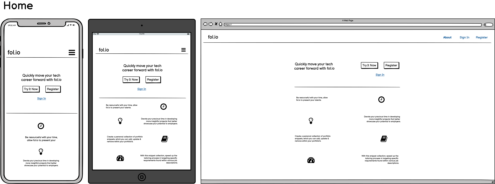
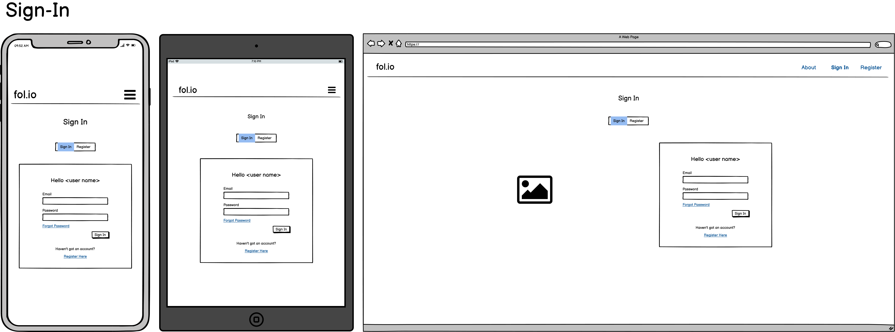

#  fol.io Wireframes

Within this markdown file you will find all the wireframes created during the skeleton phase of fol.io. All wireframes were created using [Balsamiq](https://balsamiq.com/).

If you'd like to return to the README, [click here](README.md).

## External

### Home

### Sign In

